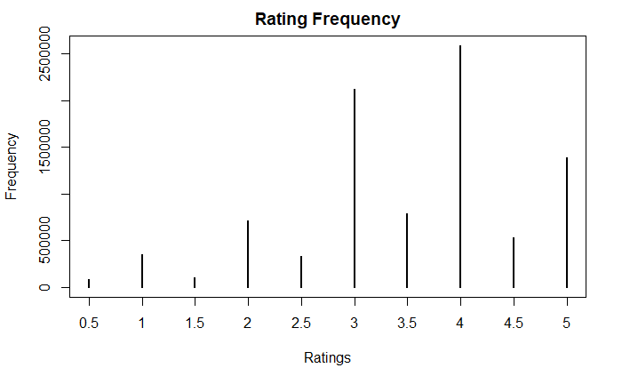
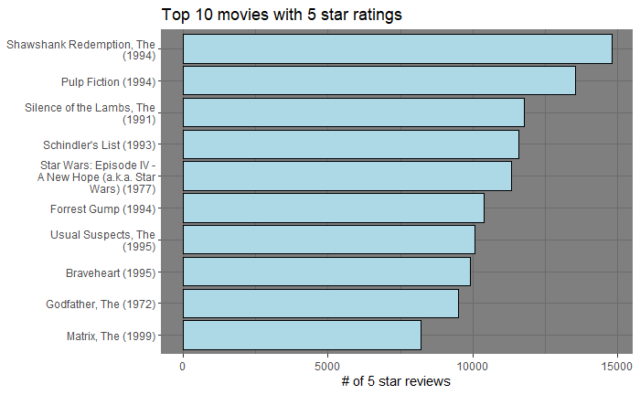
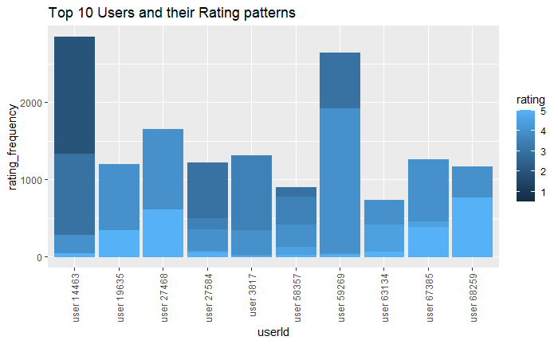

# Overview
Online streaming platforms and e-commerce most widely use Recommendation models to recommend products, movies, or music to users based on their preferences, increasing user satisfaction and retention. This project aims to develop a movie recommendation model that recommends movies to users using the MovieLens dataset provided by GroupLens, a research lab at the University of Minnesota. The main steps in the project involve the following:
- Exploring the dataset's structure.
- Performing Exploratory Data Analysis (EDA).
- Developing a machine-learning model for the movie recommendation system.

# Methods/Analysis
## Process and Techniques used
1. We begin by downloading the dataset.
2. Split the dataset into training (edx) and testing (validation) datasets. We are not supposed to use the Validation set (the final hold-out test set) to experiment with various parameters or cross-validation. So we will create an additional partition of training and testing datasets from the edx dataset to experiment with multiple parameters or cross-validation. 
3. Next, we will explore the data by creating visualizations and gaining insights into the dataset.
4. Based on the insights gained from the EDA process, we will create machine learning models starting with the most straightforward approach and progressively improving the model performance. We will be using Residual Mean Square Error (RMSE) to measure the performance of various models, and our goal is to reduce the RMSE below the target value of 0.8649. When the model reaches the RMSE target in the testing set, we will train the edx dataset with the model and use the validation dataset to test the model performance.

## Data Extraction
### Downloading MovieLens Dataset
[Full Version of MovieLens Dataset](https://grouplens.org/datasets/movielens/latest/) has 27 million ratings and 1.1 million tag applications applied to 58,000 movies by 280,000 users. However, this project will use the [10M version of the MovieLens dataset](https://grouplens.org/datasets/movielens/10m/) released in Jan 2009, with 10 million ratings on 10,000 movies by 72,000 users.

## Data Transformation
### Splitting MovieLens Dataset into Training and Testing Datasets
We split the MovieLens dataset into a training dataset called edx and an evaluation dataset called validation. The edx and validation set will have 90% and 10% of MovieLens data, respectively. While we create the validation set, we ensure that all users and movies in the validation set are also available in the edx set.

### Split the edx dataset into Training and Testing Dataset
We are not supposed to use the Validation set (the final hold-out test set) to experiment with multiple parameters or cross-validation. So we will create an additional partition of training and test sets from the edx dataset to experiment with various parameters or use cross-validation. While splitting the testing set, we ensure that all users and movies in the training set are also in the training set.

## Data Exploration and Visualization
### Structure of the dataset
Let us begin by exploring the dataset structure. Training Dataset (edx) has 9,000,055 rows while Validation dataset has 999,999 rows. Each row contains a rating given by a user for a movie. Both datasets contain six columns - userId, movieId, rating, timestamp, title, and genres.
```
Classes ‘data.table’ and 'data.frame':	9000055 obs. of  6 variables:
 $ userId   : int  1 1 1 1 1 1 1 1 1 1 ...
 $ movieId  : num  122 185 292 316 329 355 356 362 364 370 ...
 $ rating   : num  5 5 5 5 5 5 5 5 5 5 ...
 $ timestamp: int  838985046 838983525 838983421 838983392 838983392 838984474 838983653 838984885 838983707 838984596 ...
 $ title    : chr  "Boomerang (1992)" "Net, The (1995)" "Outbreak (1995)" "Stargate (1994)" ...
 $ genres   : chr  "Comedy|Romance" "Action|Crime|Thriller" "Action|Drama|Sci-Fi|Thriller" "Action|Adventure|Sci-Fi" ...
 - attr(*, ".internal.selfref")=<externalptr> 
Classes ‘data.table’ and 'data.frame':	999999 obs. of  6 variables:
 $ userId   : int  1 1 1 2 2 2 3 3 4 4 ...
 $ movieId  : num  231 480 586 151 858 ...
 $ rating   : num  5 5 5 3 2 3 3.5 4.5 5 3 ...
 $ timestamp: int  838983392 838983653 838984068 868246450 868245645 868245920 1136075494 1133571200 844416936 844417070 ...
 $ title    : chr  "Dumb & Dumber (1994)" "Jurassic Park (1993)" "Home Alone (1990)" "Rob Roy (1995)" ...
 $ genres   : chr  "Comedy" "Action|Adventure|Sci-Fi|Thriller" "Children|Comedy" "Action|Drama|Romance|War" ...
 - attr(*, ".internal.selfref")=<externalptr> 
 ```
### Visualization #1: Rating Frequency
There are 10 rating categories ranging from 0.5 to 5. The following plot show that users often use whole numbers to rate a movie, and rating 4 has the highest frequency.



### Visualization #2: Movies with most five-star ratings
The following plot shows the Top 10 movies with the most five-star ratings in this dataset. It is evident from the barplot that some movies get higher ratings than others. We could notice that "Shawshank Redemption, The (1994)" received the highest (closer to 15,000) 5-star ratings.



### Visualization #3: Top 10 Users and their Rating pattern
The following plot shows the Top 10 users with the highest rating counts. We could notice from the stacked barplot that some users (e.g., user 66259) are more generous in providing higher ratings, while some (e.g., user 14463) provide relatively lower ratings.


## Modeling Approach

We will develop several machine learning models and compare their performance to determine the best model. However, we need to use a standard method to measure the performance across all models. We will use Residual-Mean-Square Error (RMSE), a frequently used measure of the differences between values predicted by a model and the observed values. We can find the RMSE of a model by:

1. Finding the residuals - the difference between values predicted by the model and the observed values. 
2. Squaring the residuals.
3. Finding the average of the squared residuals.
4. Finding the square root of the average.

We will use the training and testing dataset partitioned from the edx dataset to train and evaluate our models. Once the model reaches the goal with an RMSE below the target value of 0.8649, we will train the model with the edx dataset and test the model against the final hold-out validation test set.

### Model 1 - Average of all movie ratings
We will begin with a simple model by making predictions only using the average of all movie ratings given by all users and ignoring all other predictors and biases. The average movie rating of our training dataset is 3.512459, and if we use this average value as the prediction, the RMSE of the model is 1.126149. This RMSE is pretty much higher than our goal of 0.8649. So, let us continue to improve this model further.
```
MODEL PERFORMANCE RESULTS:
----------------------------------------------------
RMSE of Model 1 - Average : 1.0598
```
## Model 2 - Address the bias in movie rating patterns
We noticed from Visualization #2 in the EDA section that some movies get higher ratings than the rest. We also know that while we created the testing sets, we ensured that all movie Ids in the testing set were also in our training set. So, let us check if we could improve the model performance further by addressing the bias in movie ratings by using each movie's average rating instead of the average of all movie ratings given by all users.
```
MODEL PERFORMANCE RESULTS:
------------------------------------------------------------------------
RMSE of Model 1 - Average                             : 1.0598
RMSE of Model 2 - Average + Movie rating pattern bias : 0.9424
```
## Model 3 - Addressing the bias in Users' rating patterns
Let us see what we could do to improve our model further. We gained insight from Visualization #3 in the EDA section that some users could be more generous than others. We also know that while we created the testing sets, we ensured that all user Ids in the testing set were also in our training set. So, to address the bias in users' rating patterns, we could take the average rating given by each user.
```
MODEL PERFORMANCE RESULTS:
--------------------------------------------------------------------------------
RMSE of Model 1 - Average                                    : 1.0598
RMSE of Model 2 - Average + Movie rating pattern bias        : 0.9424
RMSE of Model 3 - Average + User & Movie rating pattern bias : 0.8645
```
## Model 4 - Addressing the bias in genres rating pattern
There could be bias in user rating based on the movie genres. Let us see if the model improves further by addressing the genre effect. 
```
MODEL PERFORMANCE RESULTS:
--------------------------------------------------------------------------------
RMSE of Model 1 - Average                                            : 1.0598
RMSE of Model 2 - Average + Movie rating pattern bias                : 0.9424
RMSE of Model 3 - Average + User & Movie rating pattern bias         : 0.8645
RMSE of Model 4 - Average + User, Movie & Genres rating pattern bias : 0.8642
```
## Model 5 - Regularization
There seem to be obscure movies with big predictions in our model. More significant estimates are more likely to occur when fewer users rate the film. Regularization helps penalize large estimates from smaller samples by adding a penalty for large values, thus reducing the RMSE. So, let us try regularization and see how it could improve our model results even more.
```
MODEL PERFORMANCE RESULTS:
--------------------------------------------------------------------------------
RMSE of Model 1 - Average                                              : 1.0598
RMSE of Model 2 - Average + Movie rating pattern bias                  : 0.9424
RMSE of Model 3 - Average + User & Movie rating pattern bias           : 0.8645
RMSE of Model 4 - Average + User, Movie & Genres rating pattern bias   : 0.8642
RMSE of Model 5 - Regularized Movie, User & Genres rating pattern bias : 0.8636
```
## Model 6 - Matrix Factorization using Recosystem
'Recosystem' is an R package for fast matrix factorization. Unlike most other R packages for statistical modeling that store the whole dataset and model object in memory, recosystem significantly reduces memory use, for instance, the constructed model that contains information for the prediction can be stored in the hard disk, and the output result can also be directly written into a file rather than be kept in memory. You can find more details on the recosystem [here](https://cran.r-project.org/web/packages/recosystem/vignettes/introduction.html). Let us start by converting data into the recosystem format, finding the best tuning parameters, training, and finally testing it.
```
MODEL PERFORMANCE RESULTS:
--------------------------------------------------------------------------------
RMSE of Model 1 - Average                                              : 1.0598
RMSE of Model 2 - Average + Movie rating pattern bias                  : 0.9424
RMSE of Model 3 - Average + User & Movie rating pattern bias           : 0.8645
RMSE of Model 4 - Average + User, Movie & Genres rating pattern bias   : 0.8642
RMSE of Model 5 - Regularized Movie, User & Genres rating pattern bias : 0.8636
RMSE of Model 6 - Matrix Factorization using recosystem                : 0.7860
```

# Results
RMSE of our Model 6 using training and testing dataset reached below our target of 0.8649. So, now let us test the accuracy of model 6 using the edx dataset against the final hold-out validation set. 
```
MODEL PERFORMANCE RESULTS:
--------------------------------------------------------------------------------
RMSE of Model 1 - Average                                              : 1.0598
RMSE of Model 2 - Average + Movie rating pattern bias                  : 0.9424
RMSE of Model 3 - Average + User & Movie rating pattern bias           : 0.8645
RMSE of Model 4 - Average + User, Movie & Genres rating pattern bias   : 0.8642
RMSE of Model 5 - Regularized Movie, User & Genres rating pattern bias : 0.8636
RMSE of Model 6 - Matrix Factorization using recosystem                : 0.7860
Final Matrix Factorization Recosystem Model on Validation Test Set     : 0.7832
```

# Conclusion
We started with a simple model and kept improving the model further until our model reached the target accuracy. Our best model uses the Recosystem package for Matrix Factorization with RMSE 0.7832, significantly less than our target of 0.8649.

## Limitations
Most modern recommendation models use many predictors. We used only three predictors, the movie, user, and genre information ignoring other features. This model would work only for existing users and films and not provide recommendations for new users or movies.

## Future Work
There are other recommendation system packages like Lab for Developing and Testing Recommender Algorithms([recommenderlab](https://cran.r-project.org/web/packages/recommenderlab/index.html)), Smart Adaptive Recommendations([SAR](https://cran.r-project.org/web/packages/SAR/index.html)), Sparse Linear Method to Predict Ratings and Top-N Recommendations([slimrec](https://cran.r-project.org/web/packages/slimrec/index.html)), Collective Matrix Factorization for Recommender Systems ([cmfrec](https://cran.r-project.org/web/packages/cmfrec/index.html)), A Group-Specific Recommendation System ([gsrs](https://cran.r-project.org/web/packages/gsrs/index.html)) available in [CRAN](https://cran.microsoft.com/snapshot/2019-04-15/web/packages/available_packages_by_name.html) that we could try to further generalize and improve the model in the future.

## Acknowledgments
I want to thank the instructor, Rafael A. Irizarry of HarvardX's Professional Certificate in Data Science, for the detailed and clear explanation in his lectures throughout the series. I would also like to thank and appreciate the staff and peers for providing their support, help, and guidance in the discussion forums.

## References
1. Rafael A. Irizarry, [Introduction to Data Science: Data Analysis and Prediction Algorithms with R](https://rafalab.github.io/dsbook) 
2. Yixuan Qiu (2017), [recosystem: recommendation System Using Parallel Matrix Factorization](https://cran.r-project.org/web/packages/recosystem/vignettes/introduction.html)
